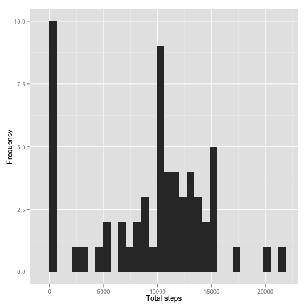

# Reproducible Research: Peer Assessment 1

---

## Introduction
This assignment makes use of data from a personal activity monitoring device. This device collects data at 5 minute intervals through out the day. The data consists of two months of data from an anonymous individual collected during the months of October and November, 2012 and include the number of steps taken in 5 minute intervals each day.

The data is downloaded from the course web site and it consists of 17,568 values for 3 variables:
* steps: Number of steps taking in a 5-minute interval (missing values are coded as NA)
* date: The date on which the measurement was taken in YYYY-MM-DD format
* interval: Identifier for the 5-minute interval in which measurement was taken


## Loading and preprocessing the data

First, we read in the data:

```r
activity <- read.csv('activity.csv')
```

Then we take a quick look at the structure of the data:

```r
str(activity)
```

```
## 'data.frame':	17568 obs. of  3 variables:
##  $ steps   : int  NA NA NA NA NA NA NA NA NA NA ...
##  $ date    : Factor w/ 61 levels "2012-10-01","2012-10-02",..: 1 1 1 1 1 1 1 1 1 1 ...
##  $ interval: int  0 5 10 15 20 25 30 35 40 45 ...
```

We create a date.time column that combines the date and interval columns:

```r
time <- formatC(activity$interval / 100, 2, format='f')
activity$date.time <- as.POSIXct(paste(activity$date, time),
                                 format='%Y-%m-%d %H.%M',
                                 tz='GMT')
head(activity)
```

```
##   steps       date interval           date.time
## 1    NA 2012-10-01        0 2012-10-01 00:00:00
## 2    NA 2012-10-01        5 2012-10-01 00:05:00
## 3    NA 2012-10-01       10 2012-10-01 00:10:00
## 4    NA 2012-10-01       15 2012-10-01 00:15:00
## 5    NA 2012-10-01       20 2012-10-01 00:20:00
## 6    NA 2012-10-01       25 2012-10-01 00:25:00
```

For analyzing the means at different times of the day, we create a time column:

```r
activity$time <- format(activity$date.time, format='%H:%M:%S')
activity$time <- as.POSIXct(activity$time, format='%H:%M:%S')
head(activity)
```

```
##   steps       date interval           date.time                time
## 1    NA 2012-10-01        0 2012-10-01 00:00:00 2014-10-19 00:00:00
## 2    NA 2012-10-01        5 2012-10-01 00:05:00 2014-10-19 00:05:00
## 3    NA 2012-10-01       10 2012-10-01 00:10:00 2014-10-19 00:10:00
## 4    NA 2012-10-01       15 2012-10-01 00:15:00 2014-10-19 00:15:00
## 5    NA 2012-10-01       20 2012-10-01 00:20:00 2014-10-19 00:20:00
## 6    NA 2012-10-01       25 2012-10-01 00:25:00 2014-10-19 00:25:00
```

## What is the mean total number of steps taken per day?

First, we calculate the total number of steps for each day:

```r
total.steps <- tapply(activity$steps, activity$date, sum, na.rm=TRUE)
```

Then we plot a histogram of the daily values:

```r
library(ggplot2)
qplot(total.steps, xlab='Total steps', ylab='Frequency')
```

```
## stat_bin: binwidth defaulted to range/30. Use 'binwidth = x' to adjust this.
```

 

Next, we calculate the mean and median total steps per day:

```r
mean(total.steps)
```

```
## [1] 9354
```

```r
median(total.steps)
```

```
## [1] 10395
```

## What is the average daily activity pattern?

We first calculate the mean steps for each five minute interval and save in a new data frame:

```r
mean.steps <- tapply(activity$steps, activity$time, mean, na.rm=TRUE)
daily.pattern <- data.frame(time=as.POSIXct(names(mean.steps)),
                            mean.steps)
head(mean.steps)
```

```
## 2014-10-19 00:00:00 2014-10-19 00:05:00 2014-10-19 00:10:00 
##             1.71698             0.33962             0.13208 
## 2014-10-19 00:15:00 2014-10-19 00:20:00 2014-10-19 00:25:00 
##             0.15094             0.07547             2.09434
```

Next, we take a look at a time series plot of the mean steps:

```r
library(scales)
ggplot(daily.pattern, aes(time, mean.steps)) + 
    geom_line() +
    xlab('Time of day') +
    ylab('Mean number of steps') +
    scale_x_datetime(labels=date_format(format='%H:%M'))
```

 

Finally, we determine which five minute interval has the highest mean number of steps:

```r
most <- which.max(daily.pattern$mean.steps)
format(daily.pattern[most,'time'], format='%H:%M')
```

```
## [1] "08:35"
```


## Inputing missing values

First, we count the number of intervals with missing step counts ("NA's"):

```r
sum(is.na(activity$steps)) 
```

```
## [1] 2304
```

We replace each missing value with the mean steps:

```r
library(Hmisc)
```

```
## Loading required package: grid
## Loading required package: lattice
## Loading required package: survival
## Loading required package: splines
## Loading required package: Formula
## 
## Attaching package: 'Hmisc'
## 
## The following objects are masked from 'package:base':
## 
##     format.pval, round.POSIXt, trunc.POSIXt, units
```

```r
# make a copy of the activity dataframe
activity.imputed <- activity
# replace the missing values with the mean
activity.imputed$steps <- with(activity.imputed, impute(steps, mean))
head(activity.imputed)
```

```
##   steps       date interval           date.time                time
## 1 37.38 2012-10-01        0 2012-10-01 00:00:00 2014-10-19 00:00:00
## 2 37.38 2012-10-01        5 2012-10-01 00:05:00 2014-10-19 00:05:00
## 3 37.38 2012-10-01       10 2012-10-01 00:10:00 2014-10-19 00:10:00
## 4 37.38 2012-10-01       15 2012-10-01 00:15:00 2014-10-19 00:15:00
## 5 37.38 2012-10-01       20 2012-10-01 00:20:00 2014-10-19 00:20:00
## 6 37.38 2012-10-01       25 2012-10-01 00:25:00 2014-10-19 00:25:00
```

We compare the mean and median steps for each day, for the original data set and the imputed data set:

```r
total.steps.imputed <- tapply(activity.imputed$steps, 
                              activity.imputed$date, sum)
mean(total.steps)
```

```
## [1] 9354
```

```r
mean(total.steps.imputed)
```

```
## [1] 10766
```

```r
median(total.steps)
```

```
## [1] 10395
```

```r
median(total.steps.imputed)
```

```
## [1] 10766
```

Replacing the missing data increases the mean and median total steps.

Finally, we generate a histogram of the imputed dataset:

```r
all.steps <- as.data.frame(cbind(total.steps, total.steps.imputed))
library(reshape)
melted.all.steps <- melt(all.steps)
```

```
## Using  as id variables
```

```r
qplot(value,data=melted.all.steps,fill=variable)
```

```
## stat_bin: binwidth defaulted to range/30. Use 'binwidth = x' to adjust this.
```

 

We can see that there are now more step values with the imputed data set. 

## Are there differences in activity patterns between weekdays and weekends?

First we add a factor column for whether a day is a weekday or weekend:

```r
day.type <- function(date) {
    if (weekdays(date) %in% c('Saturday', 'Sunday')) {
        return('weekend')
    } else {
        return('weekday')
    }
}

day.types <- sapply(activity.imputed$date.time, day.type)
activity.imputed$day.type <- as.factor(day.types)
```

We then create a dataframe that holds the mean steps for weekdays and weekends:

```r
mean.steps <- tapply(activity.imputed$steps, 
                     interaction(activity.imputed$time,
                                 activity.imputed$day.type),
                     mean, na.rm=TRUE)
day.type.pattern <- data.frame(time=as.POSIXct(names(mean.steps)),
                               mean.steps=mean.steps,
                               day.type=as.factor(c(rep('weekday', 288),
                                                   rep('weekend', 288))))
```

Next we compare the patterns between weekdays and weekends:

```r
ggplot(day.type.pattern, aes(time, mean.steps)) + 
    geom_line() +
    xlab('Time of day') +
    ylab('Mean number of steps') +
    scale_x_datetime(labels=date_format(format='%H:%M')) +
    facet_grid(. ~ day.type)
```

 
